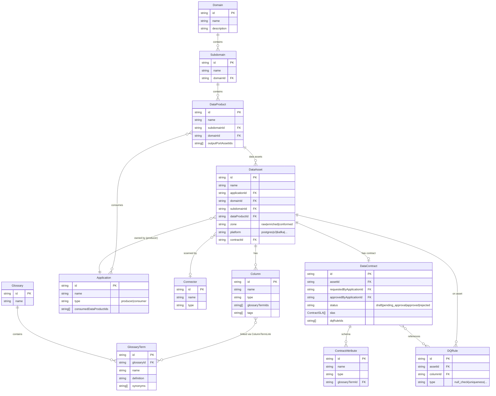
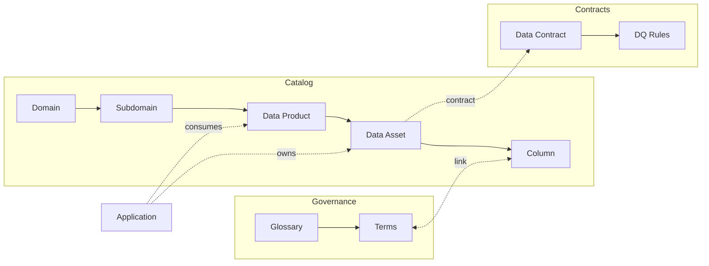
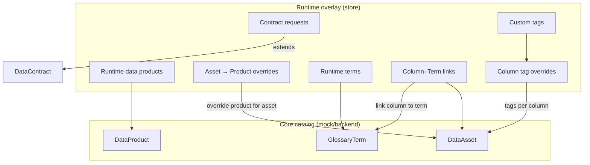

# Data Catalog — Model (visual)

Render this in any [Mermaid](https://mermaid.js.org/) viewer (e.g. GitHub, VS Code Mermaid extension, [mermaid.live](https://mermaid.live)).

---

## Core catalog (entities & relationships)

---

## Simplified view (for slides)

High-level flow: **Domain → Subdomain → Data Product → Assets → Columns**; **Glossary → Terms** linked to columns; **Contracts** and **Applications** tie to assets.

---

## Runtime overlay (in-memory state)

User-created or override data that sits on top of the core catalog:

---

*Generated from `src/data/model.ts` and `src/data/DATA_MODEL.md`.*
